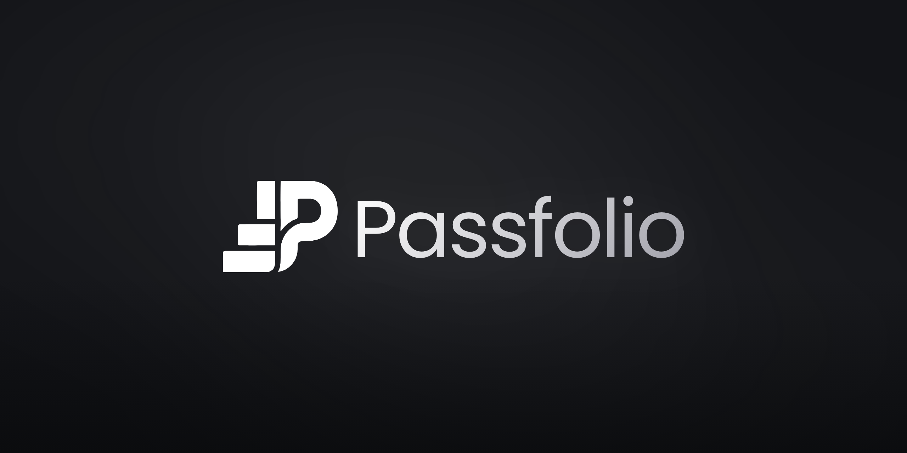
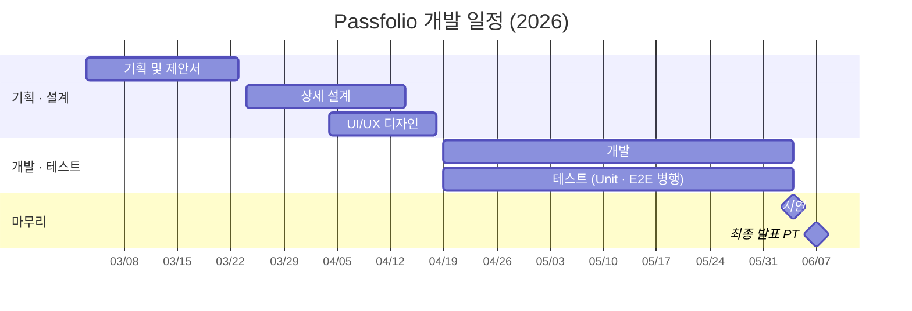

# Passfolio — Frontend

 

# Project Introduction

## What

**"프로젝트 경험을, 증명 가능한 포트폴리오로."** 
**Passfolio** — Pass(합격) + Portfolio(포트폴리오), 이름 그대로 **'합격하는 포트폴리오'** 를 지향합니다. 
개발자 취업 준비생의 **GitHub 프로젝트를 분석**하고, 이를 근거로 기존 포트폴리오를 **개선**하거나 새 포트폴리오의 **방향을 설계**해주는 서비스입니다.   
본 레포지토리는 해당 서비스의 **Frontend(Web SPA)** 를 담당합니다.

## Why

- AI발 기술 변화와 경력직 선호 속에 '쉬었음' 청년은 6년간 **약 32% 증가**(36.0만 → 47.7만 명)했고, Z세대 **92%** 가 "취업 문턱이 높아졌다"고 답했습니다.
- 채용 평가의 무게중심은 스펙에서 **'증명된 실력' — 포트폴리오·실증**으로 이동하고 있습니다.
- 그런데 정작 구직 개발자의 **57.5%** 가 "내용·성과의 논리적 정리"를, **52.5%** 가 "기여도 명시"를 가장 어려워합니다. 어려움의 본질은 디자인이 아니라 **내용 구조화**입니다.
- 기존 서비스는 문장 '교정'(첨삭)이나 git 메타데이터 기반 '템플릿'에 머물러, **개발자 포트폴리오의 '내용'에 특화된 서비스는 공백**이었습니다.

## Service Purpose

- **프로젝트 분석** : GitHub 저장소를 clone하여 코드 기여도·기술 스택·핵심 성과를 추출한 분석 리포트 생성
- **포트폴리오 개선·설계** : 분석 결과를 근거로 기존 포트폴리오 개선 및 신규 포트폴리오 방향 설계
- **성장 로드맵** : 채용 시장 기준의 역할별 스킬 커버리지 진단과 학습 경로 제시
- **자기소개서 확장** : 포트폴리오와 자기소개서의 상호 변환·개선

## Expectation

- 동일 포트폴리오 기준, 단순 문장 교정은 평가 점수 **+1.15**에 그쳤지만 **코드 분석을 결합한 개선은 60.2 → 77.8(+17.5)** 을 달성 — '근거 있는 내용 개선'의 효과를 정량적으로 확인했습니다.
- 기여도·핵심 기능·성과가 코드에서 자동 도출되므로, 지원자는 **객관적 근거로 실력을 증명**할 수 있습니다.

## Main Target

- **연령대** : 20대 초반 ~ 30대 초반의 IT 취업 준비생·주니어 개발자
- **특징** : GitHub에 프로젝트 경험은 있으나 이를 포트폴리오 '내용'으로 구조화하는 데 어려움을 겪음
- **니즈** : 기여도·성과의 객관적 증명, 채용 시장 기준의 방향 제시, 문서 작성 부담 경감

## + More

서비스의 구체적인 내용은 아래에서 확인하실 수 있습니다. 

- **서비스** : [@Passfolio Site](https://www.passfolio.dev)
- **발표 자료 (Web PPT)** : [@Passfolio PPT](https://www.passfolio.dev/docs/passfolio-deck)

💡 구글에 Passfolio라고 검색해도 최상단에 나와요 😆

---

# Team Introduction

## Frontend Members 

| **김태현** | **박준우** |
|:--------:|:---------:|
| [   @Youcu](https://github.com/Youcu) | [   @parkjunwoo0209](https://github.com/parkjunwoo0209) |
| 파트리더 · 풀스택 | 팀원 · 프론트엔드 |

 

## Other Parts

### Backend — [@Passfolio/Backend](https://github.com/Passfolio/Backend)

| **김태현** | **송성호** |
|:--------:|:---------:|
| [   @Youcu](https://github.com/Youcu) | [   @sungho1949](https://github.com/sungho1949) |
| 파트리더 · 풀스택 | 팀원 · 백엔드 |

### Portfolio-AI — [@Passfolio/Portfolio-AI](https://github.com/Passfolio/Portfolio-AI)

| **이상빈** | **박준우** | **송성호** |
|:--------:|:---------:|:---------:|
| [   @dltkdqlsco](https://github.com/dltkdqlsco) | [   @parkjunwoo0209](https://github.com/parkjunwoo0209) | [   @sungho1949](https://github.com/sungho1949) |
| 팀 리더 | 파트리더 · 팀원 | 팀원 |

### Project-Analyzer-AI

| **김태현** |
|:--------:|
| [   @Youcu](https://github.com/Youcu) | 
| 파트리더 · 프로젝트 분석 AI |
> 본 Part의 Repo는 Private으로 비공개 영역입니다.

 

---

# Development

## Key Features

Frontend 파트가 담당하는 서비스 핵심 기능입니다.

- **GitHub OAuth 로그인 & 저장소 분석 시작** : GitHub 연동 후 저장소를 선택해 분석을 시작하는 진입 플로우
- **실시간 분석 진행률** : SSE(EventSource) 기반으로 저장소별 분석 진행률·상태를 실시간 표시
- **포트폴리오 · 자기소개서 결과 뷰** : 분석 리포트 조회, 개선 전/후 비교, PDF 업로드(S3 멀티파트)
- **학습 로드맵** : React Flow 기반의 역할별 스킬 커버리지·학습 경로 시각화
- **아티클** : Tiptap 에디터 기반 게시글 작성·조회 (관리자)
- **Documentation & Web PPT** : 서버리스 문서 페이지와 reveal.js 기반 발표 덱 뷰어
- **Admin** : 단일 기능 테스트 환경, 회원관리, Article / Documentation 작성

 

## Environment

| Category | Stack |
| :--- | :--- |
| **Frontend** |          |
| **버전 관리** |  |
| **협업 툴** |   |
| **CI/CD** |  |
| **Infra** |   |

 

## Docs
### Team Documentation
- **서비스 Documentation** : [@passfolio.dev/docs](https://www.passfolio.dev/docs)
- **발표 자료 (Web PPT)** : [@Passfolio Deck](https://www.passfolio.dev/docs/passfolio-deck)
- **FE Deployment** : [@Notion-Passfolio FE Deployment](https://hooby.notion.site/Cloudflare-FE-Deployment-347f6c063f3e80e682d7ef1ceffa369f?source=copy_link)

💡 Architecture는 PPT 참조

### Member's Personal Documentation
- **Harness Engineering** : [@Notion-Harness Engineering](https://hooby.notion.site/Harness-Engineering-351f6c063f3e80f79dcef01bdaced788?source=copy_link)  

 

## Timeline

- **기획 및 제안서** : 2026.03.03 ~ 2026.03.23
- **상세 설계** : 2026.03.24 ~ 2026.04.14
- **UI/UX 디자인** : 2026.04.04 ~ 2026.04.18
- **개발 착수** : 2026.04.19 ~ 2026.06.04
- **테스트 (Unit · E2E 병행)** : 2026.04.19 ~ 2026.06.04
- **시연** : 2026.06.04
- **최종 발표 PT** : 2026.06.07

 

## Management

- **관리 방식** : 파트별 분업 + 주간 단위 반복(스프린트 유사)으로 진행, 파트 간 인터페이스(API·웹훅)는 사전 합의 후 병렬 개발
- **이슈 관리** : GitHub Issues로 기능·버그 단위 추적
- **문서 관리** : Notion에 기획안·회의록·기술 문서 기록, 서비스 문서는 웹 Documentation 페이지로 공개
- **소스 코드 관리** : GitHub Pull Request 기반 코드 리뷰 및 히스토리 관리, Discord로 실시간 커뮤니케이션

---

💬 **About Passfolio Team**

> ◦ 명지대학교(자연) 캡스톤 디자인 프로젝트를 진행한 **Team 20세기's** 입니다. 
> ◦ 재학생 4인 구성으로, 4개 파트(FE · BE · Portfolio-AI · Project-Analyzer-AI)를 나누어 협업했습니다. 
> ◦ 현재 서버 운영은 일시 중단 상태이며, **2026년 12월 정식 출시**를 목표로 재정비 중입니다. 문의: hooby@passfolio.dev
