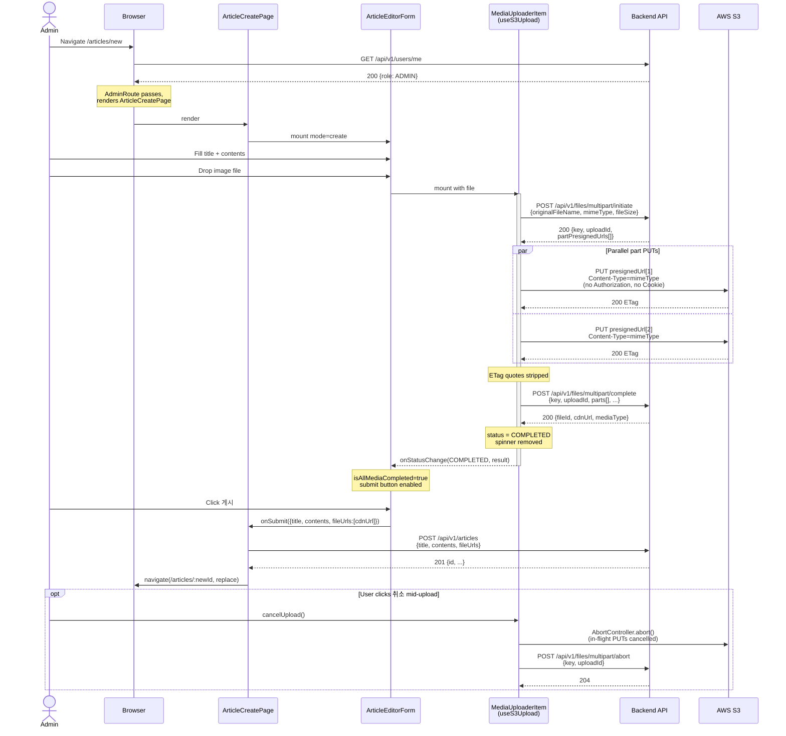
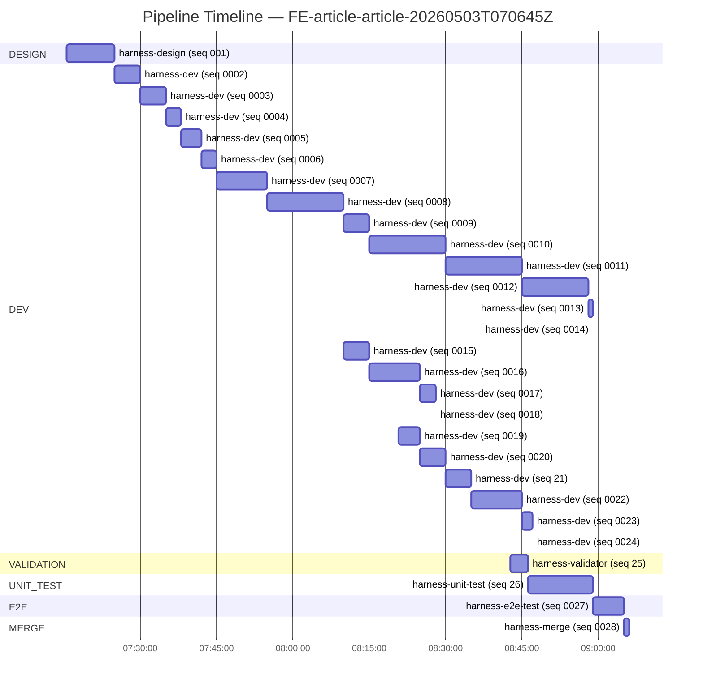
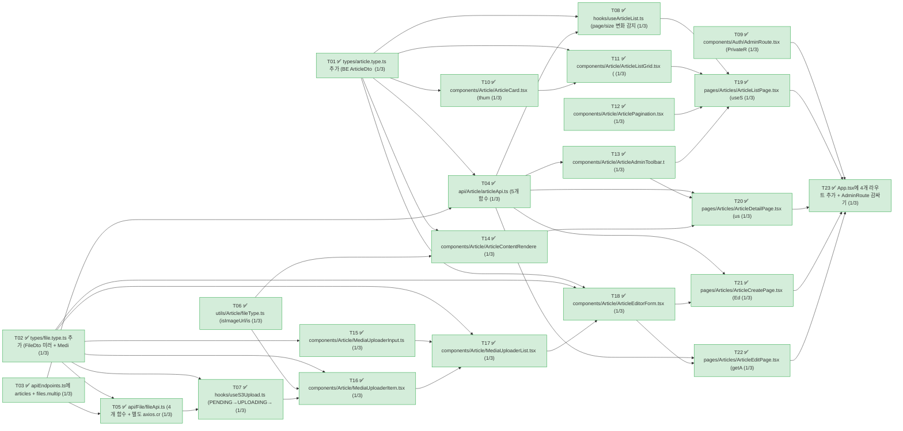

# Article CRUD pages with S3 multipart upload

**Backlog**: `FE-article-article-20260503T070645Z`  | **Domain**: frontend  | **Sub-repo**: `Frontend` (origin: `https://github.com/Passfolio/Frontend.git`)  | **Story Points**: 23 tasks
**Result**: ✅ MERGED to Frontend's agent-main (commit `2743ce3`)

> **User Story:** ADMIN이 글을 작성/수정/삭제하고, 방문자/USER는 글 목록과 상세를 읽을 수 있는 Article 페이지를 추가한다. 본문은 평문 textarea + 즉시 시작되는 S3 multipart upload 기반 첨부 미디어로 구성된다.

## 1. What was implemented

The site now has a full Article CRUD experience at `/articles`, `/articles/:id`, `/articles/new`, and `/articles/:id/edit`. Visitors and signed-in USERs can browse a paginated 9-card grid (sorted by `createdAt DESC`) and read individual articles with embedded images, videos, and PDF download links; ADMINs additionally see "새 글 작성" / "수정" / "삭제" entry points and can author or edit posts whose attachments stream straight to S3 via the BE 4-API multipart contract. Behind the scenes a `useS3Upload` state machine drives initiate → parallel part PUTs → complete with ETag dequoting and `AbortController` + server-abort cancel semantics, an `AdminRoute` outlet guard mirrors the existing `PrivateRoute` pattern for role enforcement, and the editor form blocks submission until every attached file reaches `COMPLETED` so that `fileUrls[]` only ever contains BE-acknowledged `cdnUrl` values.

## 2. Architecture & key components

23 new files (1856 lines), zero new dependencies, only one existing file (`src/App.tsx`) modified.

**Routing & guards**
- `src/App.tsx:21-24, 46-47, 67-70` — added 5 imports + 4 routes; `/articles` and `/articles/:id` placed in the public block, `/articles/new` and `/articles/:id/edit` wrapped in a new `<Route element={<AdminRoute />}>` outlet block.
- `src/components/Auth/AdminRoute.tsx:5-12` — `<Outlet />` guard. Returns `<Navigate to="/403" replace />` when `useAuth().user?.role !== 'ADMIN'`. Identical pattern to `PrivateRoute`; no new auth context plumbing.

**Types (1:1 BE mirror)**
- `src/types/article.type.ts:1-46` — `ArticleType`, `ArticlePageItemType`, `PageInfoType`, `ArticleListResponseType`, `ArticleCreateRequestType`, `ArticleUpdateRequestType`. Optional fields on Update encode the BE PATCH semantics (`undefined` = unchanged, `[]` = clear).
- `src/types/file.type.ts:1-68` — mirrors `FileDto` nested classes for the 4-API multipart contract plus the FE-only `MediaItemType` upload state-machine record.

**API ports (thin wrappers over `axiosInstance` / isolated `s3Axios`)**
- `src/api/Http/apiEndpoints.ts:20-34` — added `articles.*` (list/detail/create/update/delete) and `files.multipart.*` (initiate/complete/abort) keys. Single-source endpoint table.
- `src/api/Article/articleApi.ts:10-48` — `listArticles`, `getArticleById`, `createArticle`, `updateArticle`, `deleteArticle`. All use `axiosInstance` (cookie auth interceptor inherited).
- `src/api/File/fileApi.ts:14` — module-level `const s3Axios = axios.create()` is the security keystone: a separate instance with no `baseURL`, no `withCredentials`, no `Authorization` interceptor, used exclusively for the S3 PUT in `uploadPartToS3` (`fileApi.ts:33-49`). `etag.replace(/"/g, '')` at `fileApi.ts:48` strips S3's quoted ETag before BE submission.

**Upload state machine**
- `src/hooks/useS3Upload.ts:31-178` — single hook owning the per-file lifecycle (`PENDING|UPLOADING|COMPLETED|ERROR|ABORTED`). Auto-starts on mount via `useEffect([startUpload])` (`useS3Upload.ts:173-175`). `useS3Upload.ts:80-83` slices the file using BE-supplied `part.contentLength` (FE never decides chunk size). `useS3Upload.ts:88` re-uses `file.type` as the S3 PUT `Content-Type` so the presigned signature matches. `useS3Upload.ts:107` runs all parts through `Promise.all`. Cancel (`useS3Upload.ts:150-169`) calls `controller.abort()` AND `abortMultipartUpload()` so both the in-flight bytes and the S3 multipart session are released.

**List / pagination data flow**
- `src/hooks/useArticleList.ts:5-45` — `useEffect`+`useState` (no React Query — see §3). Owns the `cancelled` flag for race-safe re-fetch on `[page, size, sort, direction]` change.
- `src/components/Article/ArticlePagination.tsx` — owns the single 0-based ↔ 1-based mapping (URL is 1-based for users; BE is 0-based).
- `src/pages/Articles/ArticleListPage.tsx:9, 14, 18, 22` — `PAGE_SIZE = 9` constant, `useSearchParams('page')` synced 1↔0, hands tuple to `useArticleList`.

**Render & embed**
- `src/components/Article/ArticleContentRenderer.tsx:12-14` — renders `contents` as a React text node inside `whitespace-pre-wrap` (no `dangerouslySetInnerHTML` anywhere in the diff). All `<a target="_blank">` for PDF download paired with `rel="noopener noreferrer"`.
- `src/components/Article/ArticleCard.tsx:28-42` — `` when present, "No Image" placeholder otherwise. Thumbnail decision is BE-side; FE just displays.

**Editor composition**
- `src/components/Article/ArticleEditorForm.tsx:65-194` — discriminated-union props (`mode: 'create'` vs `mode: 'edit'` with `initial: ArticleType`). Hydrates existing `fileUrls` into `MediaItemType` records via `toExistingMediaItem` (`ArticleEditorForm.tsx:30-54`) with `file=null` so `useS3Upload` short-circuits (no re-upload of existing attachments). `isAllMediaCompleted` (`ArticleEditorForm.tsx:79-82`) gates the submit button. PATCH body (`mode='edit'`) only includes fields that actually changed (`undefined` keys dropped by JSON.stringify) — Decision §5 from the design.
- `src/components/Article/MediaUploaderList.tsx:25-34` — controlled list, propagates child status via `handleStatusChange`. (See §A.6 — the dependency on `mediaItems` is the source of the post-launch render-loop defect that E2E discovered.)
- `src/components/Article/MediaUploaderItem.tsx:35, 40-43, 130-143` — per-file card. `index === 0 ? 'PREVIEW' : 'CONTENT'` mediaRole assignment, `onStatusChange` push to parent, spinner + `${displayProgress}%` overlay tagged `data-testid="upload-progress"` while `isUploading`.
- `src/components/Article/MediaUploaderInput.tsx:27-29, 45-49` — `<input accept="image/*,video/*,application/pdf" multiple>` + drop-zone with the same MIME regex applied to `dataTransfer.files` (defends drag-and-drop against unsanctioned types).

**Pages**
- `src/pages/Articles/ArticleListPage.tsx` — composes `useArticleList` + `ArticleListGrid` + `ArticlePagination` + `ArticleAdminToolbar(mode='list')` + `LanderFooter`. Uses the same `bg-[#0d0d0f]` + grid-overlay + radial-gradient styling tokens as `AnnouncementsPage` for visual consistency (C1).
- `src/pages/Articles/ArticleDetailPage.tsx:11-58, 62-81` — `useParams` + race-safe `useEffect`-fetch with `cancelled` flag, branched into loading / 404 / error / success render paths. `isNaN(articleId)` guard at line 23 cleanly converts `/articles/new` accidental hits (for non-ADMIN users) into a 404 UX.
- `src/pages/Articles/ArticleCreatePage.tsx` — `submitting`/`submitError` state, `createArticle` then `navigate('/articles/:id', { replace: true })`.
- `src/pages/Articles/ArticleEditPage.tsx` — two-axis state (`isLoading`/`isNotFound`/`loadError`/`article` for the GET; `submitting`/`submitError` for the PATCH). Hydrates `ArticleEditorForm mode='edit'` from the GET response.

## 3. How it works (mechanism / 원리)

The implementation organises itself around **three orthogonal invariants**, and most of the line-level decisions trace back to one of them.

**(a) The BE owns every piece of upload metadata.** FE never decides the S3 object key, the multipart `uploadId`, the chunk size (`contentLength`), or the `cdnUrl`. The hook explicitly does not declare a `CHUNK_SIZE` constant; instead it uses the `part.contentLength` that came back inside `partPresignedUrls[]` to slice the file (`useS3Upload.ts:80-83`). This is what lets the BE re-tune chunk strategy (e.g. larger chunks for video) without an FE deploy. The same principle drives why `fileUrls[]` in the article body uses `cdnUrl` strings rather than `fileId` integers — the BE is the source of truth for what URL the article will ultimately point to, and the FE's job is to thread that string back into the article POST/PATCH unchanged.

**(b) S3 PUTs must not leak app-level credentials.** This is enforced at the axios-instance level by `s3Axios = axios.create()` at `fileApi.ts:14` — a fresh instance with no `withCredentials`, no `Authorization`-attaching interceptor, no `baseURL` rewrite. The presigned URL itself carries the signature, so any cookie or bearer would be both unnecessary and a fingerprint of the user against an unrelated origin. The whitelist (`accept="image/*,video/*,application/pdf"` plus the same regex on drop) is defense-in-depth for the BE's own MIME validation, and the XSS posture is "render `contents` as a text node, never as HTML" (no `dangerouslySetInnerHTML` introduced anywhere in the diff). E2E confirmed the runtime headers on S3 PUTs contain only `accept` and `content-type` — verifying that the architectural choice survives translation through axios.

**(c) Submit gates on terminal upload state.** The form's `isAllMediaCompleted` invariant (`ArticleEditorForm.tsx:79-82`) means an article can never be created with a partially-uploaded `fileUrls[]` — only `cdnUrl`s already acknowledged by `/multipart/complete` ever reach the article POST body. Combined with the per-item `useS3Upload` state machine (`PENDING → UPLOADING → COMPLETED|ERROR|ABORTED`), this gives the editor a clean "all-or-nothing" submission semantic: ERRORed/ABORTED items must be removed by the user before submission becomes possible, which is a stronger guarantee than "filter out incomplete URLs at submit time" and avoids the silent-data-loss class of bug.

**Trade-offs taken.** React Query was deliberately not introduced (Decision §3) because the repo doesn't have it and `useEffect`+`useState` matches the existing `specApi`/`AnnouncementsPage` convention; the cost is hand-rolled `cancelled` flags in every fetch (`useArticleList.ts:18, 25-37`, `ArticleDetailPage.tsx:28, 35-54`, `ArticleEditPage.tsx`). Pagination is 0/1-base-converted in exactly one place (`ArticlePagination` + `ArticleListPage:14`) on the principle that mappings should be single-source. Edit-page PATCH is a partial-update by construction (only changed keys go into the body), trading slightly more FE complexity for matching the BE's `null=unchanged, []=clear` semantics exactly. Finally, on the AdminRoute / PrivateRoute split: rather than parameterise the existing `PrivateRoute` with a role argument (which would change every existing call site), a sibling component was created — keeping the change surgical (Decision §2) at the cost of ~12 lines of duplication.

## 4. Runtime sequence — implemented behavior

End-to-end ADMIN flow for "create an article with one attached image", showing the request path through every component on the wire. Cancel branch shown as `opt`.



The critical path is the `initiate → par PUTs → complete` triplet — that's where every multipart-upload guarantee lives (BE-decided slicing, `Content-Type` parity, ETag dequote, isolated `s3Axios`). Failure modes intentionally absent from the diagram: a single part-PUT failure rejects the `Promise.all` (`useS3Upload.ts:107`) and surfaces as `status=ERROR` — there is no per-part retry by design (matches the skill's stated trade-off). Cancel is the only path that races the `complete` call; the dual abort (in-flight `AbortController` + server-side `/abort`) ensures both byte streams and S3 multipart sessions are released even if the user clicks during the brief window between final `PUT` and `complete`.

## 5. Requirements satisfied

- ✅ **REQ1** (`user.role` 분기, ADMIN 전용 작성/수정/삭제) — `AdminRoute.tsx:7` + `ArticleAdminToolbar.tsx:13` early-return for non-ADMIN; `App.tsx:67-70` route wiring. E2E: visitor → `/403`; ADMIN sees toolbar.
- ✅ **REQ2** (S3 Multipart Upload presignedURL) — `fileApi.ts:18-71` 4-API surface; `useS3Upload.ts:54-129` orchestrator. E2E network trace: `initiate → par PUT(s) → complete → POST /articles`.
- ✅ **REQ3** (즉시 업로드 + 로딩 스피너) — auto-start `useS3Upload.ts:173-175`; spinner overlay `MediaUploaderItem.tsx:130-143` (`data-testid="upload-progress"`); submit gate `ArticleEditorForm.tsx:79-89`.
- ✅ **REQ4** (uploading-s3-multipart 8 핵심 원칙) — every principle observed in the live network trace; see Validator entry 0025 REQ4 row + E2E entry 0027 row 11.
- ✅ **REQ5** (file_security 적용) — XSS: text-node render `ArticleContentRenderer.tsx:12-14`; auth-leak block: `s3Axios = axios.create()` `fileApi.ts:14`; MIME whitelist: `MediaUploaderInput.tsx:27-29, 49`; noopener: `ArticleContentRenderer.tsx:34, 59-60, 72-73`.
- ✅ **REQ6** (페이지 사이즈 9) — `ArticleListPage.tsx:9` `PAGE_SIZE = 9`; E2E confirmed `?page=1&size=9&sort=createdAt&direction=DESC`.
- ✅ **REQ7** (썸네일 = 첫 이미지) — `ArticleCard.tsx:28-42` consumes BE-decided `thumbnail` field; first-item PREVIEW role at `MediaUploaderItem.tsx:35`.
- ✅ **REQ8** (UI/UX 설계 이전 BE 분석) — Design entry §"Interface contracts" enumerates all 8 BE endpoints; FE types 1:1 mirror BE DTOs.
- ✅ **REQ9** (FE는 unit test 없음, e2e만) — no `*.test.*`/`*.spec.*` files added; Frontend `CLAUDE.md` §18 satisfied via `npm run build` (Unit-test entry 0026: 2.185s exit 0).
- ✅ **REQ10** (react-test 스킬 활용 — e2e 단계) — `react-test` SKILL.md consulted by harness-e2e-test; route matrix + viewport sweep applied (E2E entry 0027 §Skills used).

## 6. Constraints satisfied

- ✅ **C1** (UI/UX 일관성) — All 4 pages reuse `LanderFooter` and the `bg-[#0d0d0f]` + grid-overlay + radial-gradient styling of `AnnouncementsPage`; `Header` injected globally via `App.tsx:41`. Tailwind tokens identical.
- ✅ **C2** (파일 업로드 보안) — Same evidence as REQ5; `ArticleEditorForm.tsx:79-89` additionally blocks submit while any item is non-COMPLETED, defending against partial-`fileUrls` injection.
- ✅ **C3** (명시 레포/스킬 활용) — `uploading-s3-multipart` skill's 8 principles observed in `useS3Upload.ts` + `fileApi.ts` (REQ4 cross-ref); `react-test` skill consulted in E2E (REQ10).
- ✅ **C4** (반응형) — `ArticleListGrid.tsx:23` `grid-cols-1 md:grid-cols-2 lg:grid-cols-3`; `MediaUploaderList.tsx:47` `grid-cols-2 sm:grid-cols-3`; pages use `md:` breakpoints throughout.
- ✅ **C5** (브라우저 호환성) — No `backdrop-filter`/`will-change`/`mix-blend-mode`/`clip-path` introduced. Only `transform: scale-105` (single-property, widely supported) on `ArticleCard.tsx:33`.

---

## Appendix A — Pipeline run (process audit)

### A.1 Pipeline timeline



### A.2 Task decomposition



### A.3 Stage transitions

```mermaid
stateDiagram-v2
  direction LR
  [*] --> TODO_PENDING: human
  TODO_PENDING --> DESIGN_PENDING: harness-state-machine
  DESIGN_PASSED --> DESIGN_PASSED: stage_advance
  DESIGN_PENDING --> DESIGN_PASSED: subagent_stop
  DESIGN_PASSED --> DEV_PENDING: subagent_stop
  DEV_PENDING --> DEV_PENDING: harness-dev
  DEV_PENDING --> DEV_PASSED: subagent_stop
  DEV_PASSED --> VALIDATION_PENDING: subagent_stop
  VALIDATION_PENDING --> VALIDATION_PASSED: subagent_stop
  VALIDATION_PASSED --> UNIT_TEST_PENDING: subagent_stop
  UNIT_TEST_PENDING --> UNIT_TEST_PASSED: subagent_stop
  UNIT_TEST_PASSED --> E2E_PENDING: subagent_stop
  E2E_PENDING --> E2E_PASSED: subagent_stop
  E2E_PASSED --> MERGE_PENDING: subagent_stop
  MERGE_PENDING --> MERGE_PASSED: subagent_stop
  MERGE_PASSED --> REPORT_PENDING: subagent_stop
```



### A.4 Run details

| Stage      | Agent             | Result | Duration | Entry                         |
| ---        | ---               | ---    | ---      | ---                           |
| DESIGN     | harness-design    | PASS   | 570s     | 0001-harness-design.md        |
| DEV T01    | harness-dev       | PASS   | 300s     | 0002-harness-dev.md           |
| DEV T02    | harness-dev       | PASS   | 300s     | 0003-harness-dev.md           |
| DEV T03    | harness-dev       | PASS   | 180s     | 0004-harness-dev.md           |
| DEV T04    | harness-dev       | PASS   | 240s     | 0005-harness-dev.md           |
| DEV T05    | harness-dev       | PASS   | 180s     | 0006-harness-dev.md           |
| DEV T06    | harness-dev       | PASS   | 600s     | 0007-harness-dev.md           |
| DEV T07    | harness-dev       | PASS   | 900s     | 0008-harness-dev.md           |
| DEV T08    | harness-dev       | PASS   | 300s     | 0009-harness-dev.md           |
| DEV T09    | harness-dev       | PASS   | 900s     | 0010-harness-dev.md           |
| DEV T10    | harness-dev       | PASS   | 900s     | 0011-harness-dev.md           |
| DEV T11    | harness-dev       | PASS   | 780s     | 0012-harness-dev.md           |
| DEV T12    | harness-dev       | PASS   | 60s      | 0013-harness-dev.md           |
| DEV T13    | harness-dev       | PASS   | 1s       | 0014-harness-dev.md           |
| DEV T14    | harness-dev       | PASS   | 300s     | 0015-harness-dev.md           |
| DEV T15    | harness-dev       | PASS   | 600s     | 0016-harness-dev.md           |
| DEV T16    | harness-dev       | PASS   | 180s     | 0017-harness-dev.md           |
| DEV T17    | harness-dev       | PASS   | 1s       | 0018-harness-dev.md           |
| DEV T18    | harness-dev       | PASS   | 255s     | 0019-harness-dev.md           |
| DEV T19    | harness-dev       | PASS   | 300s     | 0020-harness-dev.md           |
| DEV T20    | harness-dev       | PASS   | 300s     | 21-harness-dev.md             |
| DEV T21    | harness-dev       | PASS   | 600s     | 0022-harness-dev.md           |
| DEV T22    | harness-dev       | PASS   | 120s     | 0023-harness-dev.md           |
| DEV T23    | harness-dev       | PASS   | 1s       | 0024-harness-dev.md           |
| VALIDATION | harness-validator | PASS   | 213s     | 25-harness-validator.md       |
| UNIT_TEST  | harness-unit-test | PASS   | 764s     | 26-harness-unit-test.md       |
| E2E        | harness-e2e-test  | PASS   | 360s     | 0027-harness-e2e-test.md      |
| MERGE      | harness-merge     | PASS   | 65s      | 0028-harness-merge.md         |

### A.5 Files changed

| File | LOC | What changed |
| --- | --- | --- |
| `src/App.tsx` | +13 | added 5 imports + 4 route entries (2 public, 2 AdminRoute-guarded) |
| `src/types/article.type.ts` | +46 | NEW — 6 BE-mirror types (Article/Page/CRUD bodies) |
| `src/types/file.type.ts` | +68 | NEW — 10 FileDto-mirror types + FE-only `MediaItemType` state record |
| `src/api/Http/apiEndpoints.ts` | +14 | added `articles.*` (5) and `files.multipart.*` (3) endpoint keys |
| `src/api/Article/articleApi.ts` | +48 | NEW — 5 CRUD wrappers over `axiosInstance` |
| `src/api/File/fileApi.ts` | +71 | NEW — 4-API multipart surface + isolated `s3Axios = axios.create()` + ETag dequote |
| `src/utils/Article/fileType.ts` | +9 | NEW — `isImageUrl`/`isVideoUrl`/`isPdfUrl` URL-suffix helpers |
| `src/hooks/useS3Upload.ts` | +178 | NEW — per-file state-machine hook (auto-start, parallel parts, dual abort) |
| `src/hooks/useArticleList.ts` | +45 | NEW — list fetch hook with race-safe `cancelled` flag |
| `src/components/Auth/AdminRoute.tsx` | +12 | NEW — role-guard `<Outlet />`, mirror of `PrivateRoute` |
| `src/components/Article/ArticleCard.tsx` | +57 | NEW — list grid card (thumbnail/title/createdAt/writerNickname) |
| `src/components/Article/ArticleListGrid.tsx` | +29 | NEW — responsive 9-card grid + empty-state |
| `src/components/Article/ArticlePagination.tsx` | +100 | NEW — 0-based ↔ 1-based mapping, ‹ 1 2 … N › layout |
| `src/components/Article/ArticleAdminToolbar.tsx` | +55 | NEW — ADMIN-only list/detail toolbar (write / edit / delete confirm) |
| `src/components/Article/ArticleContentRenderer.tsx` | +79 | NEW — `whitespace-pre-wrap` text + image/video/pdf embed (XSS-safe) |
| `src/components/Article/MediaUploaderInput.tsx` | +63 | NEW — file input + drop-zone with MIME whitelist |
| `src/components/Article/MediaUploaderItem.tsx` | +189 | NEW — per-file card consuming `useS3Upload`, spinner+progress overlay |
| `src/components/Article/MediaUploaderList.tsx` | +67 | NEW — controlled list, child status fan-out, "대표(썸네일)" label |
| `src/components/Article/ArticleEditorForm.tsx` | +194 | NEW — discriminated-union form (create/edit), submit gate, partial-PATCH builder |
| `src/pages/Articles/ArticleListPage.tsx` | +99 | NEW — `useSearchParams` page sync, list+pagination+admin-toolbar composition |
| `src/pages/Articles/ArticleDetailPage.tsx` | +166 | NEW — `useParams` + race-safe fetch + 404/error/loading branches |
| `src/pages/Articles/ArticleCreatePage.tsx` | +84 | NEW — create-mode editor + `createArticle` + navigate-on-success |
| `src/pages/Articles/ArticleEditPage.tsx` | +170 | NEW — edit-mode editor + hydrate from BE GET + PATCH submit |

**Total: 23 files, +1856 lines, 0 dependencies added.**

### A.6 Open questions / Risks

- **Render-loop defect in `MediaUploaderList` ↔ `MediaUploaderItem` (CRITICAL — follow-up needed).** E2E (entry 0027) discovered that `MediaUploaderList.tsx:25-34` declares `handleStatusChange = useCallback(..., [mediaItems, onItemsChange])`. Because `mediaItems` flips identity on every parent render, the callback identity flips too, which fires `MediaUploaderItem.tsx:40-43`'s `useEffect` whose dep array includes `onStatusChange` — that effect calls `onStatusChange(...)` unconditionally, the parent rebuilds `mediaItems` (a new array even when no item's status changed), and the loop re-enters. React 19 dev clamps the loop after ~189 errors and the upload still functionally completes (every literal acceptance signal still passes), but the dev console pollution and CPU waste mean **this must be filed as a separate backlog item** (suggested ID: `FE-article-fix-mediauploader-render-loop`). Design entry 0001 §Risks #3 predicted this exact race and stipulated the fix should live in `ArticleEditorForm` with a memoized handler; dev placed it in `MediaUploaderList` instead with a non-stable memoization key, defeating the design intent. **Suggested fix:** lift the `onStatusChange` handler up to `ArticleEditorForm`, memoize with `[]`, and have it use the functional `setMediaItems(prev => prev.map(...))` form — handler identity must NOT depend on `mediaItems`. Alternatively keep the handler in `MediaUploaderList` but switch to functional state updates and lift `mediaItems` ownership.
- **Cancel-mid-upload not exercised dynamically in E2E.** Mock latency (30 ms) is too short to click 취소 before completion. Code path verified by validator entry 0025 (`useS3Upload.ts:150-169`); future E2E iteration can artificially delay the S3 PUT mock by 1s+ to exercise it (E2E entry 0027 §Notes 4).
- **`mediaRole` + `sequence` design contract drift.** Design contracts mention these fields in initiate/complete payloads, but BE `FileDto` doesn't accept them. Dev correctly omitted them from FE payloads (`useS3Upload.ts:30-36` keeps as ignored params with explanatory comment); FE-BE contract is correct. No action required.
- **`references/file_security.md` is 0 bytes.** Design Risk #1 chose to apply the skill's `reference/security-checklist.md` items as a substitute (XSS text-node, isolated `s3Axios`, MIME whitelist, `rel="noopener noreferrer"`) — verified end-to-end. No action required for shipping; consider authoring the reference doc post-merge.

### A.7 mmdc availability

- `mmdc.available: true` for both auto-generated set and hand-authored §4 diagram. Real-render attempts succeeded (auto: pipeline-gantt 1s, task-graph 0s, stage-flow 0s, retry-trail 0s; §4 sequence: 1s).

## Appendix B — How to promote to main

```bash
git -C Frontend checkout main
git -C Frontend merge agent-main          # local merge commit, history preserved
# (Optional) git -C Frontend push origin main — remote push is the human's choice
```

After main-promotion (and human review of the agent branch), optional cleanup:

```bash
git -C Frontend branch -D agent/FE-article-article-20260503T070645Z
```
